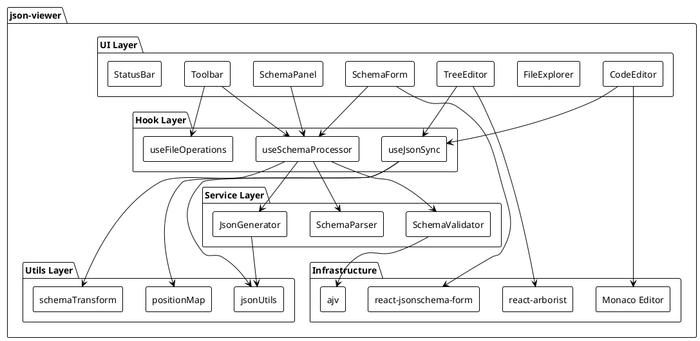
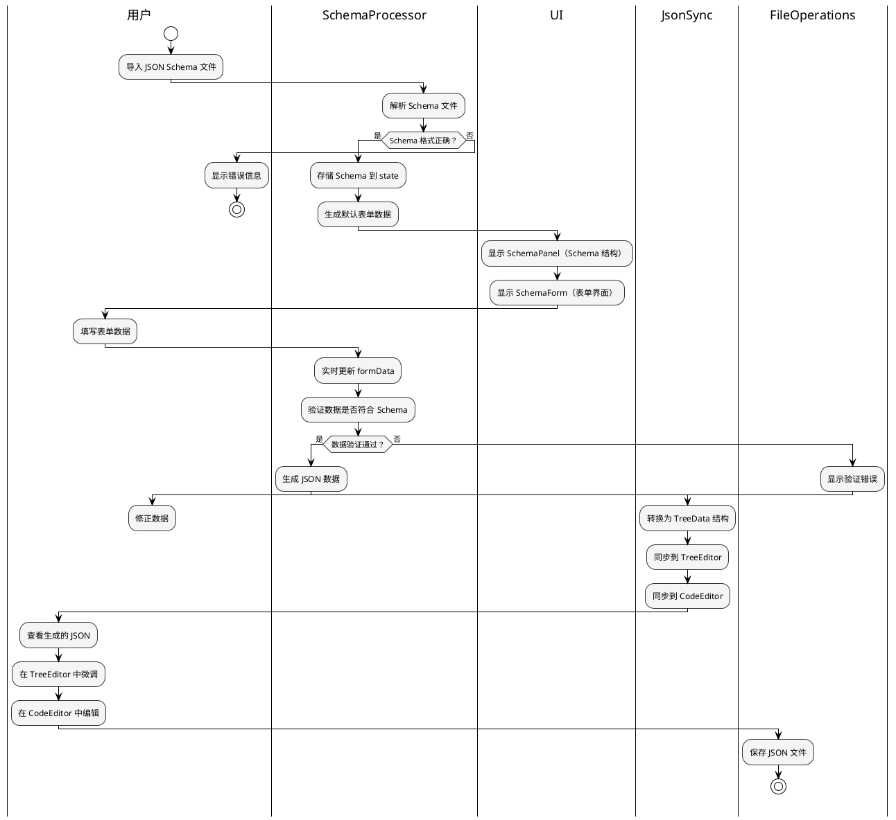
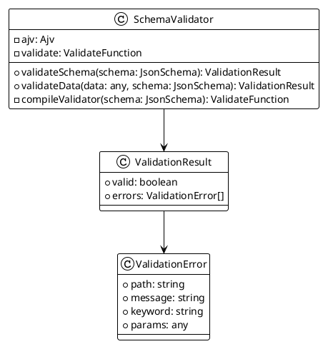
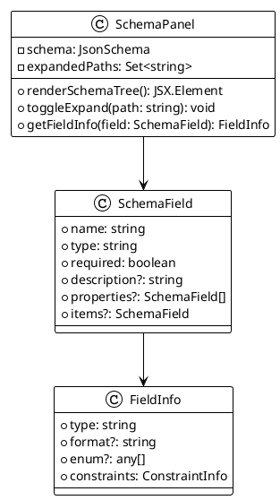
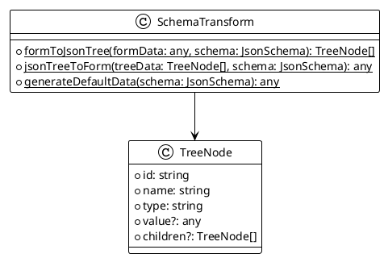
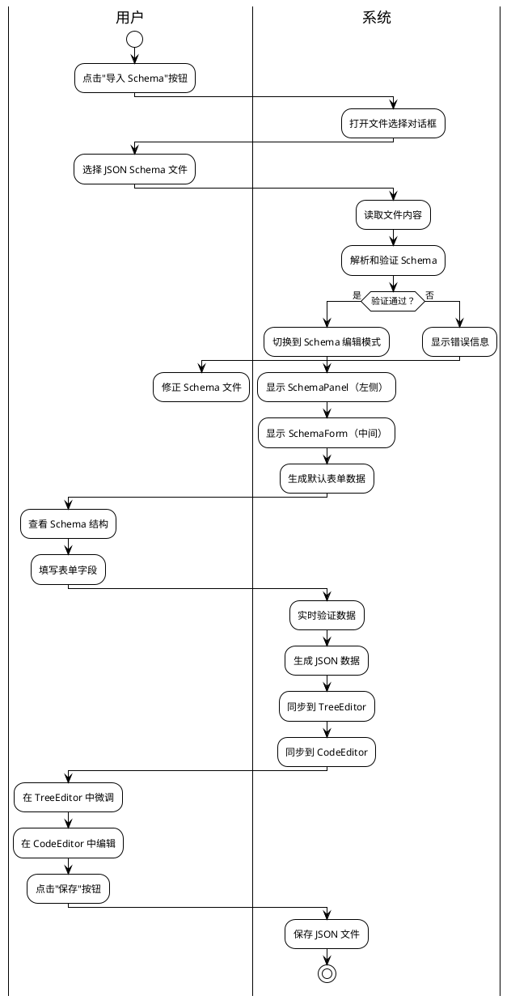
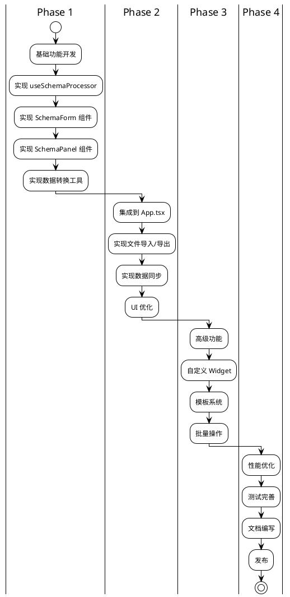

# JSON Schema 可视化生成 JSON 文件设计方案

## 1. 项目概述

### 1.1 背景

json-viewer 项目已经具备完整的 JSON 编辑能力（TreeEditor + CodeEditor 双向同步），现在需要增加基于 JSON Schema 可视化生成 JSON 文件的功能。

### 1.2 目标

- 导入 JSON Schema 文件
- 根据 Schema 自动生成可视化表单界面
- 用户通过表单填写数据，实时生成符合 Schema 的 JSON
- 支持 Schema 验证和数据校验
- 与现有 TreeEditor、CodeEditor 无缝集成

### 1.3 核心价值

```
JSON Schema → 可视化表单 → 用户填写 → 生成 JSON → 编辑/保存
```

## 2. 系统架构设计

### 2.1 整体架构图



### 2.2 数据流图



## 3. 核心模块设计

### 3.1 Schema 处理模块

#### 3.1.1 useSchemaProcessor Hook

**职责**：管理 Schema 加载、表单数据、验证逻辑

```typescript
interface UseSchemaProcessorReturn {
  schema: JsonSchema | null;           // 当前加载的 Schema
  formData: Record<string, any>;       // 表单数据
  validationErrors: ValidationError[]; // 验证错误
  loadSchema: (content: string) => Promise<LoadResult>;
  updateFormData: (data: Record<string, any>) => void;
  generateJson: () => string;
  resetSchema: () => void;
}
```

**核心功能**：
- Schema 文件加载和解析
- 表单数据状态管理
- 实时验证（基于 ajv）
- JSON 生成
- 默认值填充

#### 3.1.2 Schema 验证服务



### 3.2 UI 组件模块

#### 3.2.1 SchemaPanel 组件

**职责**：展示 Schema 结构和字段信息



**功能特性**：
- 树形展示 Schema 结构
- 显示字段类型、描述、约束
- 标识必填字段
- 支持展开/折叠
- 点击字段跳转到表单对应位置

#### 3.2.2 SchemaForm 组件

**职责**：基于 RJSF 生成可视化表单

```plantuml
@startuml
!theme plain
class SchemaForm {
  - schema: JsonSchema
  - formData: Record<string, any>
  - uiSchema: UiSchema
  - validator: Validator
  
  + handleChange(event: IChangeEvent): void
  + handleSubmit(event: IChangeEvent): void
  + renderForm(): JSX.Element
  - convertToRJSFSchema(schema: JsonSchema): RJSFSchema
}

class RJSFSchema {
  + type: string
  + properties: Record<string, RJSFSchema>
  + items?: RJSFSchema
  + required?: string[]
}

class UiSchema {
  + "ui:order"?: string[]
  + "ui:widget"?: string
  + "ui:options"?: any
}

SchemaForm --> RJSFSchema
SchemaForm --> UiSchema
SchemaForm --> "react-jsonschema-form" as rjsf
@enduml
```

**支持的 Schema 特性**：
- 基础类型：string、number、integer、boolean、null
- 对象类型：嵌套对象、属性定义
- 数组类型：items 定义、minItems、maxItems
- 字符串约束：minLength、maxLength、pattern、format
- 数值约束：minimum、maximum、exclusiveMinimum、exclusiveMaximum
- 枚举值：enum
- 默认值：default
- 必填字段：required
- 格式验证：email、uri、date、time、date-time、ipv4、ipv6、uuid

#### 3.2.3 数据转换模块



**转换逻辑**：
- `formToJsonTree`：表单数据 → 树形结构（用于 TreeEditor）
- `jsonTreeToForm`：树形结构 → 表单数据（用于回填表单）
- `generateDefaultData`：根据 Schema 生成默认数据

### 3.3 集成模块

#### 3.3.1 与现有系统集成

```plantuml
@startuml
!theme plain
package "App.tsx" {
  [Toolbar] as toolbar
  [SchemaPanel] as schemaPanel
  [SchemaForm] as schemaForm
  [TreeEditor] as treeEditor
  [CodeEditor] as codeEditor
}

package "State Management" {
  [schema: JsonSchema | null] as schemaState
  [formData: Record<string, any>] as formDataState
  [treeData: TreeNode[]] as treeDataState
  [jsonText: string] as jsonTextState
}

toolbar --> schemaState : onImportSchema
schemaPanel --> schemaState : schema
schemaForm --> formDataState : formData
treeEditor --> treeDataState : data
codeEditor --> jsonTextState : value

schemaState --> treeDataState : formToJsonTree
formDataState --> jsonTextState : generateJson
treeDataState --> jsonTextState : updateFromTree

@enduml
```

**集成策略**：
1. **模式切换**：未导入 Schema 时显示 TreeEditor，导入后显示 SchemaForm
2. **数据同步**：SchemaForm 数据变化 → 转换为 TreeData → 同步到 TreeEditor 和 CodeEditor
3. **双向编辑**：用户可以在 SchemaForm 填写，也可以在 TreeEditor/CodeEditor 中微调

## 4. 技术选型

### 4.1 核心依赖

| 库 | 版本 | 用途 |
|---|---|---|
| @rjsf/core | ^5.x | 表单生成核心 |
| @rjsf/utils | ^5.x | RJSF 工具函数 |
| @rjsf/validator-ajv8 | ^5.x | 基于 ajv8 的验证器 |
| ajv | ^8.x | JSON Schema 验证 |

### 4.2 为什么选择 RJSF

**优势**：
- ✅ 成熟的 Schema 驱动表单解决方案（GitHub 15k+ stars）
- ✅ 完整的 JSON Schema Draft-07 支持
- ✅ 丰富的 widget 和 field 自定义能力
- ✅ 内置验证和错误展示
- ✅ 活跃的社区和完善的文档

**替代方案对比**：
- ❌ Formily：过于复杂，学习成本高
- ❌ JSON Editor：功能强大但体积大，定制性差
- ❌ 自研：开发周期长，维护成本高

## 5. 实现方案

### 5.1 文件结构

```
src/
├── components/
│   ├── SchemaForm/
│   │   ├── SchemaForm.tsx              # RJSF 表单组件
│   │   ├── SchemaForm.module.css
│   │   └── DemoPage.tsx                # 演示页面
│   ├── SchemaPanel/
│   │   ├── SchemaPanel.tsx             # Schema 结构面板
│   │   └── SchemaPanel.module.css
├── hooks/
│   └── useSchemaProcessor.ts           # Schema 处理 Hook
├── utils/
│   └── schemaTransform.ts              # 数据转换工具
└── App.tsx                              # 主应用（已集成）
```

### 5.2 核心实现步骤

#### 步骤 1：Schema 处理 Hook

```typescript
// useSchemaProcessor.ts
export function useSchemaProcessor() {
  const [schema, setSchema] = useState<JsonSchema | null>(null);
  const [formData, setFormData] = useState<Record<string, any>>({});
  const [validationErrors, setValidationErrors] = useState<ValidationError[]>([]);
  
  const loadSchema = async (content: string) => {
    try {
      const parsed = JSON.parse(content);
      const validator = new SchemaValidator();
      const result = validator.validateSchema(parsed);
      
      if (result.valid) {
        setSchema(parsed);
        setFormData(generateDefaultData(parsed));
        return { success: true };
      } else {
        return { success: false, error: 'Schema 验证失败' };
      }
    } catch (e) {
      return { success: false, error: 'Schema 解析失败' };
    }
  };
  
  const generateJson = () => {
    return JSON.stringify(formData, null, 2);
  };
  
  return {
    schema,
    formData,
    validationErrors,
    loadSchema,
    updateFormData: setFormData,
    generateJson,
  };
}
```

#### 步骤 2：SchemaForm 组件

```typescript
// SchemaForm.tsx
export function SchemaForm({ schema, formData, onChange }: SchemaFormProps) {
  const rjsfSchema = convertToRJSFSchema(schema);
  
  const handleChange = (event: IChangeEvent) => {
    if (event.formData !== undefined) {
      onChange(event.formData);
    }
  };
  
  return (
    <Form
      schema={rjsfSchema}
      formData={formData}
      onChange={handleChange}
      validator={validator}
      liveValidate={true}
    />
  );
}
```

#### 步骤 3：数据转换

```typescript
// schemaTransform.ts
export function formToJsonTree(
  formData: any,
  schema: JsonSchema
): TreeNode[] {
  // 将表单数据转换为 TreeEditor 需要的树形结构
  return jsonToTree(formData);
}

export function generateDefaultData(schema: JsonSchema): any {
  // 根据 Schema 生成默认数据
  if (schema.type === 'object') {
    const data: any = {};
    if (schema.properties) {
      for (const [key, prop] of Object.entries(schema.properties)) {
        if (prop.default !== undefined) {
          data[key] = prop.default;
        } else if (prop.type === 'string') {
          data[key] = '';
        } else if (prop.type === 'number' || prop.type === 'integer') {
          data[key] = 0;
        } else if (prop.type === 'boolean') {
          data[key] = false;
        } else if (prop.type === 'array') {
          data[key] = [];
        } else if (prop.type === 'object') {
          data[key] = generateDefaultData(prop);
        }
      }
    }
    return data;
  }
  return {};
}
```

#### 步骤 4：集成到 App.tsx

```typescript
// App.tsx
function App() {
  const { schema, formData, loadSchema, updateFormData, generateJson } = useSchemaProcessor();
  
  // 导入 Schema
  const handleImportSchema = async () => {
    const result = await window.electronAPI!.openFile();
    if (result.filePath) {
      const content = await window.electronAPI!.readFile(result.filePath);
      await loadSchema(content);
    }
  };
  
  // 数据同步
  useEffect(() => {
    if (schema && formData) {
      const treeData = formToJsonTree(formData, schema);
      updateFromTree(treeData);
    }
  }, [formData, schema]);
  
  return (
    <div className={styles.app}>
      <Toolbar onImportSchema={handleImportSchema} />
      
      {schema ? (
        <div style={{ display: 'flex' }}>
          <SchemaPanel schema={schema} />
          <SchemaForm
            schema={schema}
            formData={formData}
            onChange={updateFormData}
          />
        </div>
      ) : (
        <TreeEditor data={treeData} onChange={updateFromTree} />
      )}
      
      <CodeEditor value={jsonText} onChange={updateFromCode} />
    </div>
  );
}
```

## 6. 交互设计

### 6.1 用户操作流程



### 6.2 界面布局

```
┌─────────────────────────────────────────────────────────┐
│ Toolbar: [新建] [打开] [导入Schema] [保存] [刷新] ...   │
├──────────┬──────────────────────────────────────────────┤
│          │  SchemaPanel  │  SchemaForm                  │
│  File    │  ┌──────────┐ │  ┌────────────────────────┐ │
│ Explorer │  │ 字段结构  │ │  │ 名称: [___________]    │ │
│          │  │ - name   │ │  │ 年龄: [___]            │ │
│ - file1  │  │ - age    │ │  │ 邮箱: [___________]    │ │
│ - file2  │  │ - email  │ │  │ 性别: [下拉选择 ▼]     │ │
│          │  │ - gender │ │  │ 地址:                   │ │
│          │  │   - city │ │  │   城市: [___________]  │ │
│          │  └──────────┘ │  │   街道: [___________]  │ │
│          │               │  │ 爱好: [+ 添加]          │ │
│          │               │  └────────────────────────┘ │
├──────────┴──────────────────────────────────────────────┤
│ TreeEditor (可切换显示)                                  │
│ ┌─────────────────────────────────────────────────────┐ │
│ │ ▼ {                                                 │ │
│ │   ▼ "name": "张三",                                │ │
│ │   ▼ "age": 25,                                     │ │
│ │   ...                                               │ │
│ │ }                                                   │ │
│ └─────────────────────────────────────────────────────┘ │
├─────────────────────────────────────────────────────────┤
│ CodeEditor (Monaco)                                     │
│ ┌─────────────────────────────────────────────────────┐ │
│ │ 1 │ {                                               │ │
│ │ 2 │   "name": "张三",                              │ │
│ │ 3 │   "age": 25,                                   │ │
│ │ 4 │   ...                                           │ │
│ │ 5 │ }                                               │ │
│ └─────────────────────────────────────────────────────┘ │
├─────────────────────────────────────────────────────────┤
│ StatusBar: 行 1, 列 1 | 节点数: 10 | 验证: ✓          │
└─────────────────────────────────────────────────────────┘
```

## 7. 扩展性设计

### 7.1 自定义 Widget

RJSF 支持自定义表单控件：

```typescript
// 自定义日期选择器
const CustomDateWidget = (props: WidgetProps) => (
  <DatePicker
    value={props.value}
    onChange={props.onChange}
    format="YYYY-MM-DD"
  />
);

// 注册自定义 widget
const widgets = {
  DateWidget: CustomDateWidget,
};

// 在 Schema 中指定
{
  "type": "string",
  "format": "date",
  "ui:widget": "DateWidget"
}
```

### 7.2 自定义 Field

```typescript
// 自定义对象字段
const CustomObjectField = (props: FieldProps) => (
  <div className="custom-object">
    <h3>{props.schema.title}</h3>
    {props.properties.map(prop => (
      <div key={prop.name}>{prop.content}</div>
    ))}
  </div>
);
```

### 7.3 插件系统（未来扩展）

```plantuml
@startuml
!theme plain
interface SchemaPlugin {
  + name: string
  + version: string
  + init(schema: JsonSchema): void
  + getWidgets(): Record<string, Widget>
  + getFields(): Record<string, Field>
  + getValidators(): Validator[]
}

class TemplatePlugin {
  + getTemplates(): Template[]
  + applyTemplate(template: Template): void
}

class ValidationPlugin {
  + getCustomRules(): Rule[]
  + validate(data: any, rules: Rule[]): ValidationResult
}

class ExportPlugin {
  + exportFormats(): string[]
  + export(data: any, format: string): string
}

SchemaPlugin <|-- TemplatePlugin
SchemaPlugin <|-- ValidationPlugin
SchemaPlugin <|-- ExportPlugin

[PluginManager] --> SchemaPlugin : 管理
@enduml
```

## 8. 性能优化

### 8.1 大数据量优化

```typescript
// 虚拟滚动（Schema 字段很多时）
const VirtualizedSchemaPanel = () => {
  return (
    <FixedSizeList
      height={600}
      itemCount={fields.length}
      itemSize={30}
    >
      {({ index, style }) => (
        <div style={style}>
          <FieldItem field={fields[index]} />
        </div>
      )}
    </FixedSizeList>
  );
};
```

### 8.2 表单数据优化

```typescript
// 使用 useMemo 避免重复计算
const rjsfSchema = useMemo(() => {
  return convertToRJSFSchema(schema);
}, [schema]);

// 使用 useCallback 避免重复渲染
const handleChange = useCallback((event: IChangeEvent) => {
  if (event.formData !== undefined) {
    onChange(event.formData);
  }
}, [onChange]);
```

### 8.3 验证优化

```typescript
// 防抖验证
const debouncedValidate = useMemo(
  () => debounce((data: any) => {
    const result = validator.validateData(data, schema);
    setValidationErrors(result.errors);
  }, 300),
  [schema]
);
```

## 9. 测试策略

### 9.1 单元测试

```typescript
// useSchemaProcessor.test.ts
describe('useSchemaProcessor', () => {
  it('应该正确加载 Schema', async () => {
    const { result } = renderHook(() => useSchemaProcessor());
    const schema = { type: 'object', properties: { name: { type: 'string' } } };
    
    await act(async () => {
      await result.current.loadSchema(JSON.stringify(schema));
    });
    
    expect(result.current.schema).toEqual(schema);
  });
  
  it('应该生成默认数据', () => {
    const schema = {
      type: 'object',
      properties: {
        name: { type: 'string', default: '张三' },
        age: { type: 'integer', default: 25 }
      }
    };
    
    const data = generateDefaultData(schema);
    expect(data).toEqual({ name: '张三', age: 25 });
  });
});
```

### 9.2 集成测试

```typescript
// SchemaForm.integration.test.ts
describe('SchemaForm 集成测试', () => {
  it('应该根据 Schema 生成表单', () => {
    const schema = {
      type: 'object',
      properties: {
        name: { type: 'string', title: '姓名' },
        age: { type: 'integer', title: '年龄' }
      },
      required: ['name']
    };
    
    render(<SchemaForm schema={schema} formData={{}} onChange={() => {}} />);
    
    expect(screen.getByLabelText('姓名')).toBeInTheDocument();
    expect(screen.getByLabelText('年龄')).toBeInTheDocument();
  });
});
```

## 10. 实施计划

### 10.1 阶段划分



### 10.2 时间估算

| 阶段 | 任务 | 预计时间 |
|---|---|---|
| Phase 1 | 核心功能开发 | 1 周 |
| Phase 2 | 集成和优化 | 1 周 |
| Phase 3 | 高级功能 | 2 周 |
| Phase 4 | 测试和发布 | 1 周 |
| **总计** | | **5 周** |

## 11. 风险评估

### 11.1 技术风险

| 风险 | 影响 | 概率 | 缓解措施 |
|---|---|---|---|
| RJSF 版本兼容 | 高 | 中 | 锁定版本，充分测试 |
| Schema 复杂度过高 | 中 | 中 | 限制 Schema 复杂度，分页展示 |
| 数据同步性能 | 中 | 低 | 使用防抖，虚拟滚动 |
| 浏览器兼容性 | 低 | 低 | 主要支持 Electron 环境 |

### 11.2 产品风险

| 风险 | 影响 | 概率 | 缓解措施 |
|---|---|---|---|
| 用户体验不佳 | 高 | 中 | 用户测试，迭代优化 |
| 功能过于复杂 | 中 | 中 | 渐进式展示，提供引导 |
| 学习成本高 | 中 | 中 | 提供示例和文档 |

## 12. 总结

### 12.1 核心优势

1. **技术成熟**：基于 RJSF，业界标准解决方案
2. **无缝集成**：与现有 TreeEditor、CodeEditor 完美配合
3. **扩展性强**：支持自定义 Widget、Field、验证规则
4. **用户体验好**：可视化表单，实时验证，多视图协同

### 12.2 关键成功因素

1. ✅ 清晰的架构设计
2. ✅ 合理的技术选型
3. ✅ 完善的测试覆盖
4. ✅ 良好的文档支持
5. ✅ 持续的用户反馈

### 12.3 下一步行动

1. 安装依赖：`npm install @rjsf/core @rjsf/utils @rjsf/validator-ajv8 ajv`
2. 按照实施计划逐步开发
3. 优先完成 Phase 1 和 Phase 2
4. 进行用户测试和反馈收集
5. 迭代优化，逐步完善
