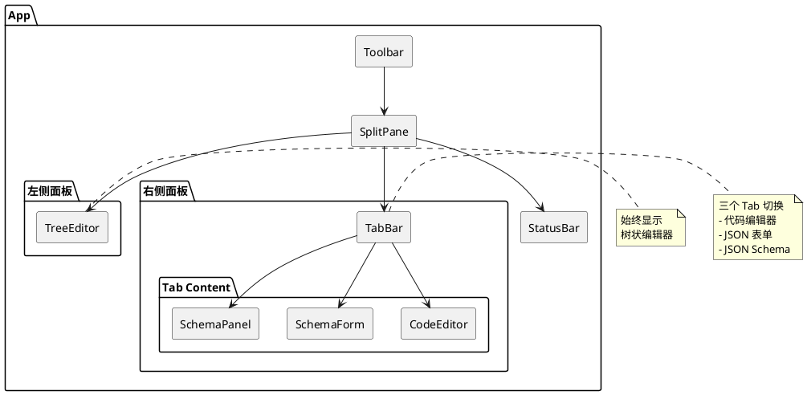
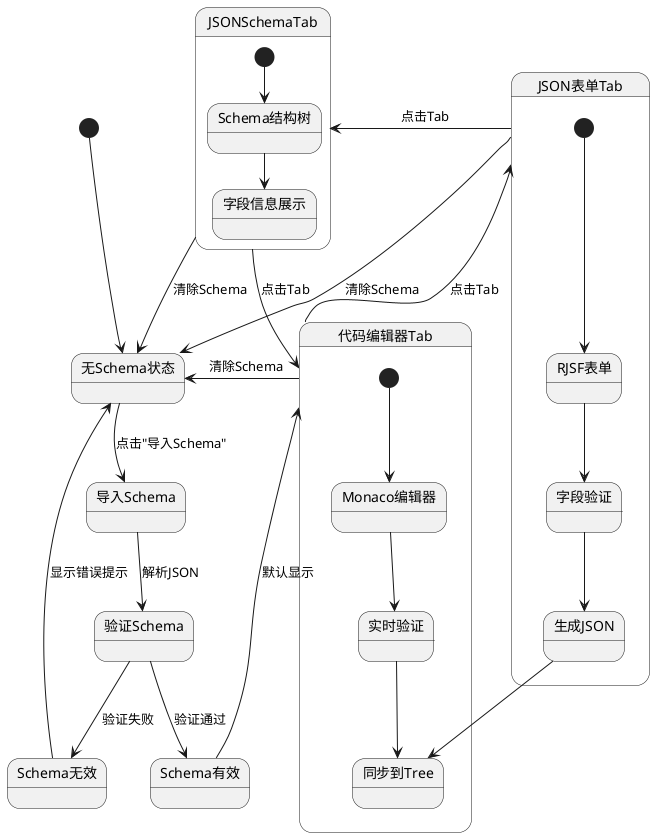
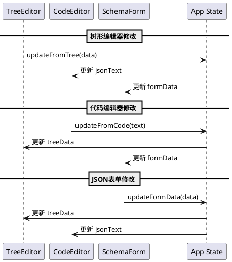
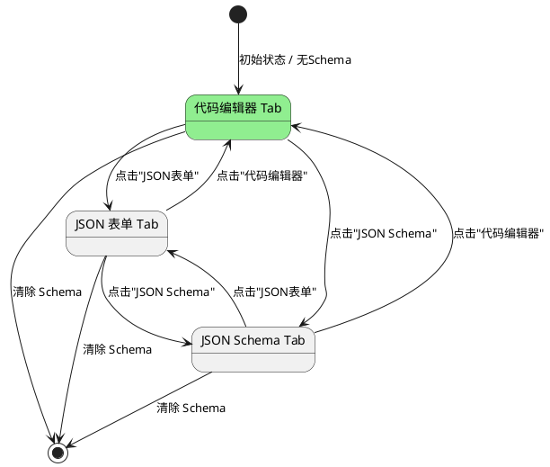
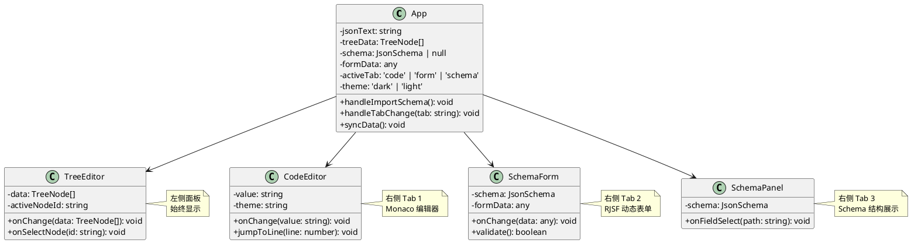
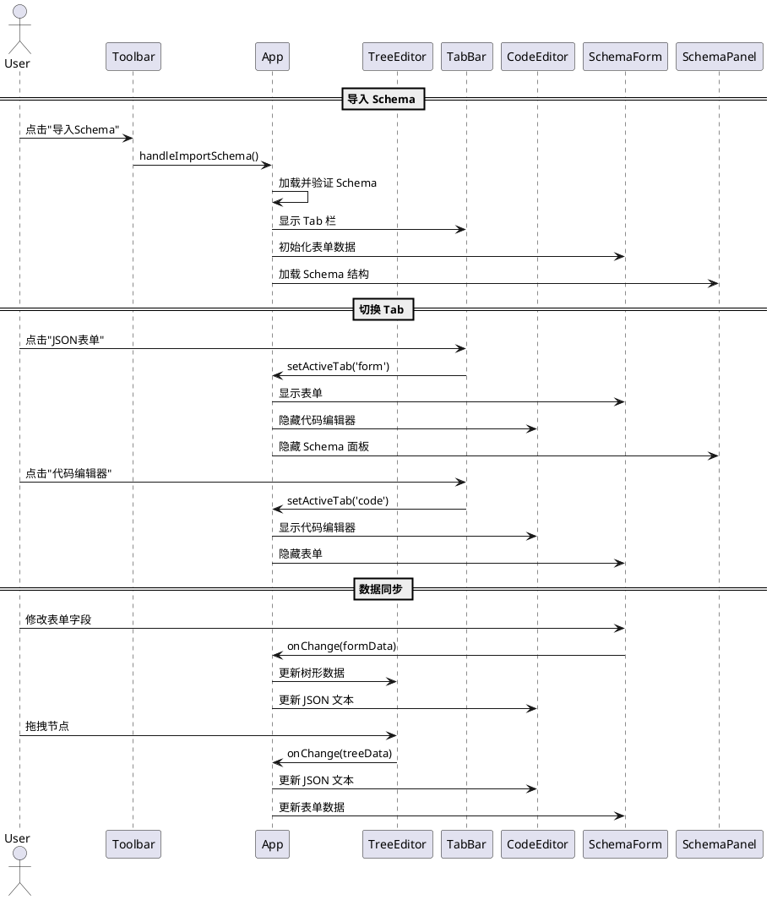
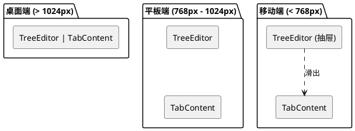
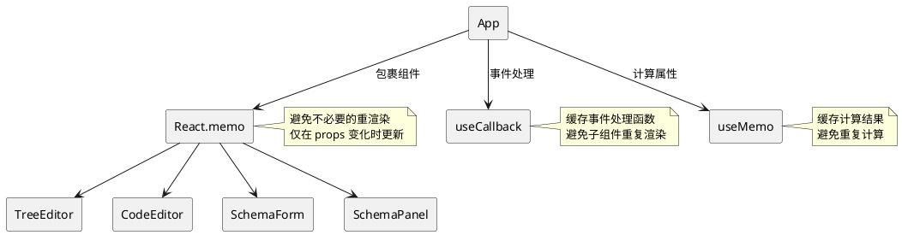
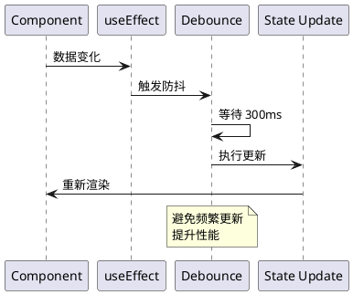
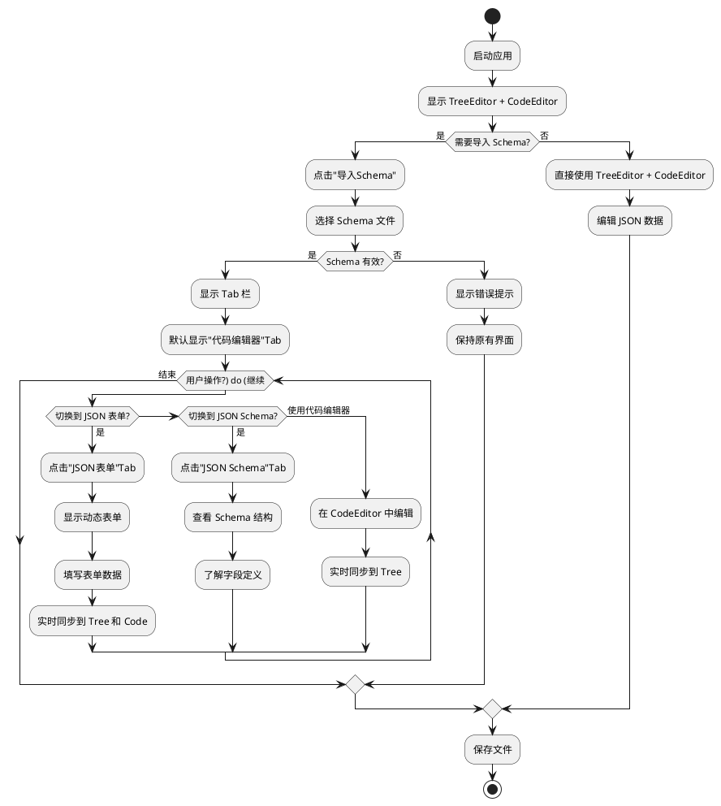

# JSON Viewer UI 布局设计方案

## 1. 整体架构

### 1.1 布局结构

```
┌─────────────────────────────────────────────────────────────┐
│                         Toolbar                              │
│  [新建] [打开] [导入Schema] [保存] [刷新] [主题] ...        │
├──────────────────┬──────────────────────────────────────────┤
│                  │  [代码编辑器] [JSON表单] [JSON Schema]    │
│                  ├──────────────────────────────────────────┤
│   TreeEditor     │                                          │
│   (树状编辑器)    │                                          │
│                  │        Tab Content Area                  │
│   - 节点树形展示  │                                          │
│   - 拖拽排序     │   - 代码编辑器: Monaco Editor            │
│   - 右键菜单     │   - JSON表单: RJSF 动态表单              │
│   - 属性编辑     │   - JSON Schema: Schema 结构展示         │
│                  │                                          │
│                  │                                          │
├──────────────────┴──────────────────────────────────────────┤
│                      StatusBar                               │
│  行: 1, 列: 1 | 节点数: 10 | 验证状态: ✓                   │
└─────────────────────────────────────────────────────────────┘
```

### 1.2 核心组件关系



## 2. 状态管理

### 2.1 状态流转图



### 2.2 数据同步流程



## 3. Tab 切换设计

### 3.1 Tab 状态机



### 3.2 Tab 样式设计

```typescript
interface TabConfig {
  id: 'code' | 'form' | 'schema';
  label: string;
  icon?: string;
  component: React.ComponentType;
}

const tabs: TabConfig[] = [
  {
    id: 'code',
    label: '代码编辑器',
    component: CodeEditor
  },
  {
    id: 'form',
    label: 'JSON 表单',
    component: SchemaForm
  },
  {
    id: 'schema',
    label: 'JSON Schema',
    component: SchemaPanel
  }
];
```

## 4. 组件职责

### 4.1 组件类图



### 4.2 组件交互序列图



## 5. 响应式布局

### 5.1 布局适配策略



### 5.2 面板宽度配置

```typescript
interface LayoutConfig {
  treeWidth: number;        // 左侧面板宽度
  minTreeWidth: number;     // 最小宽度
  maxTreeWidth: number;     // 最大宽度
  resizable: boolean;       // 是否可拖拽调整
}

const defaultLayout: LayoutConfig = {
  treeWidth: 400,
  minTreeWidth: 200,
  maxTreeWidth: 800,
  resizable: true
};
```

## 6. 性能优化

### 6.1 渲染优化策略



### 6.2 数据同步优化



## 7. 用户交互流程

### 7.1 完整使用流程



### 7.2 快捷键设计

```typescript
interface KeyboardShortcuts {
  // Tab 切换
  'Ctrl+1': '切换到代码编辑器';
  'Ctrl+2': '切换到JSON表单';
  'Ctrl+3': '切换到JSON Schema';
  
  // 通用操作
  'Ctrl+S': '保存文件';
  'Ctrl+O': '打开文件';
  'Ctrl+N': '新建文件';
  'Ctrl+Shift+S': '导入Schema';
  
  // 编辑操作
  'Ctrl+Z': '撤销';
  'Ctrl+Y': '重做';
  'Ctrl+F': '查找';
  'Ctrl+H': '替换';
}
```

## 8. 主题适配

### 8.1 主题变量

```typescript
interface ThemeVariables {
  // 基础颜色
  '--bg-primary': string;
  '--bg-secondary': string;
  '--text-primary': string;
  '--text-secondary': string;
  '--border': string;
  '--accent': string;
  
  // Tab 样式
  '--tab-bg': string;
  '--tab-bg-active': string;
  '--tab-text': string;
  '--tab-text-active': string;
  '--tab-border': string;
}

const lightTheme: ThemeVariables = {
  '--bg-primary': '#ffffff',
  '--bg-secondary': '#f5f5f5',
  '--text-primary': '#333333',
  '--text-secondary': '#666666',
  '--border': '#e8e8e8',
  '--accent': '#1890ff',
  
  '--tab-bg': 'transparent',
  '--tab-bg-active': '#ffffff',
  '--tab-text': '#666666',
  '--tab-text-active': '#333333',
  '--tab-border': '#1890ff'
};

const darkTheme: ThemeVariables = {
  '--bg-primary': '#1e1e1e',
  '--bg-secondary': '#252525',
  '--text-primary': '#d4d4d4',
  '--text-secondary': '#858585',
  '--border': '#3e3e3e',
  '--accent': '#007acc',
  
  '--tab-bg': 'transparent',
  '--tab-bg-active': '#1e1e1e',
  '--tab-text': '#858585',
  '--tab-text-active': '#d4d4d4',
  '--tab-border': '#007acc'
};
```

## 9. 扩展性设计

### 9.1 插件化 Tab

```plantuml
@startuml
skinparam componentStyle rectangle

interface TabPlugin {
  + id: string
  + label: string
  + icon?: string
  + component: React.ComponentType
  + shouldShow(): boolean
}

class CodeTabPlugin {
  + id: 'code'
  + label: '代码编辑器'
  + component: CodeEditor
  + shouldShow(): true
}

class FormTabPlugin {
  + id: 'form'
  + label: 'JSON 表单'
  + component: SchemaForm
  + shouldShow(): boolean
}

class SchemaTabPlugin {
  + id: 'schema'
  + label: 'JSON Schema'
  + component: SchemaPanel
  + shouldShow(): boolean
}

class CustomTabPlugin {
  + id: string
  + label: string
  + component: React.ComponentType
  + shouldShow(): boolean
}

TabPlugin <|-- CodeTabPlugin
TabPlugin <|-- FormTabPlugin
TabPlugin <|-- SchemaTabPlugin
TabPlugin <|-- CustomTabPlugin

[TabManager] --> TabPlugin : 管理插件

note right of TabManager
  支持动态注册 Tab
  支持条件显示
  支持自定义 Tab
end note

@enduml
```

### 9.2 未来扩展方向

1. **数据对比 Tab**：对比两个 JSON 文件的差异
2. **数据验证 Tab**：可视化展示验证结果
3. **数据转换 Tab**：JSON 与其他格式互转（XML、YAML、CSV）
4. **数据可视化 Tab**：图表展示 JSON 数据
5. **历史记录 Tab**：查看和恢复历史版本

## 10. 总结

### 10.1 设计优势

1. **清晰的布局**：左侧树形编辑器 + 右侧 Tab 切换，职责分明
2. **灵活的切换**：三个 Tab 满足不同场景需求
3. **实时的同步**：三个视图数据实时同步，保持一致性
4. **良好的扩展**：插件化设计，易于添加新功能
5. **优秀的性能**：React.memo、useCallback、useMemo 优化渲染

### 10.2 核心特性

- ✅ 树状编辑器始终显示，提供直观的节点操作
- ✅ 代码编辑器提供精确的文本编辑
- ✅ JSON 表单提供友好的表单填写体验
- ✅ JSON Schema 提供清晰的结构展示
- ✅ 三个视图数据实时同步
- ✅ 支持主题切换
- ✅ 响应式布局
- ✅ 插件化扩展

### 10.3 技术栈

- **UI 框架**：React 18 + TypeScript
- **代码编辑器**：Monaco Editor
- **表单生成**：React JSON Schema Form (RJSF)
- **树形组件**：react-arborist
- **状态管理**：React Hooks
- **样式方案**：CSS Modules + CSS Variables
