# JSON Viewer 可视化编程设计方案

## 1. 概述

本方案旨在为 json-viewer 项目增强可视化编程能力，让用户能够更直观地编辑和操作 JSON 数据。json-viewer 是一个可视化 JSON 文档编辑器，核心功能是通过树形编辑器（TreeEditor）和代码编辑器（CodeEditor）双向同步编辑 JSON 数据。

### 1.1 设计目标

- **直观性**：通过树形结构直观展示 JSON 数据层级
- **高效性**：提供快捷操作和批量编辑能力
- **准确性**：保证树形编辑和代码编辑的实时同步
- **扩展性**：支持复杂 JSON 结构的编辑和转换

### 1.2 核心功能

1. **增强树形编辑器**：拖拽排序、批量操作、快速导航
2. **智能辅助系统**：数据模板、自动补全、数据验证
3. **可视化转换**：JSON 结构转换、数据映射、格式转换
4. **多视图协同**：树形视图、代码视图、表格视图
5. **高级编辑能力**：查找替换、路径导航、数据过滤

## 2. 系统架构

### 2.1 整体架构图

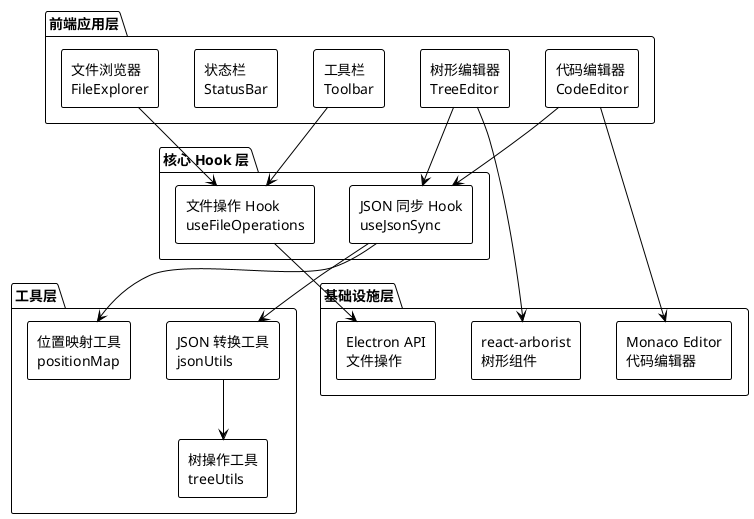

### 2.2 数据流图

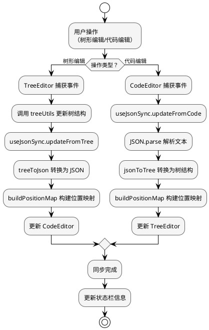

## 3. 核心模块设计

### 3.1 增强树形编辑器（TreeEditor）

#### 3.1.1 组件结构

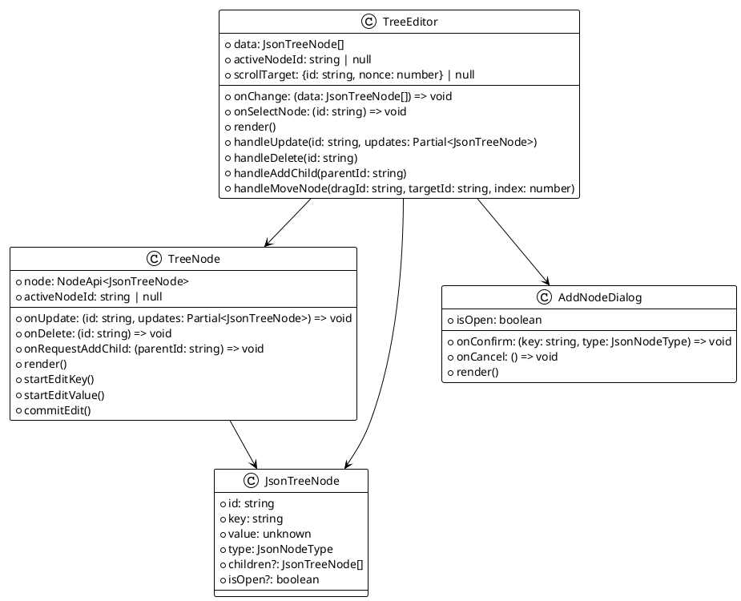

#### 3.1.2 拖拽排序流程

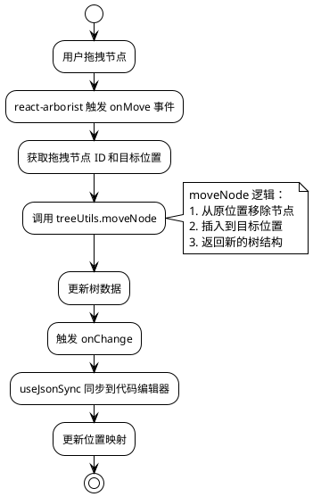

#### 3.1.3 节点类型与样式

| 节点类型 | 颜色 | 图标 | 说明 |
|---------|------|------|------|
| string | #4CAF50 (绿色) | 📝 | 字符串类型 |
| number | #2196F3 (蓝色) | 🔢 | 数字类型 |
| boolean | #9C27B0 (紫色) | ✓ | 布尔类型 |
| null | #9E9E9E (灰色) | ∅ | 空值类型 |
| object | #FF9800 (橙色) | 📦 | 对象类型 |
| array | #E91E63 (粉色) | 📋 | 数组类型 |

### 3.2 智能辅助系统

#### 3.2.1 数据模板库

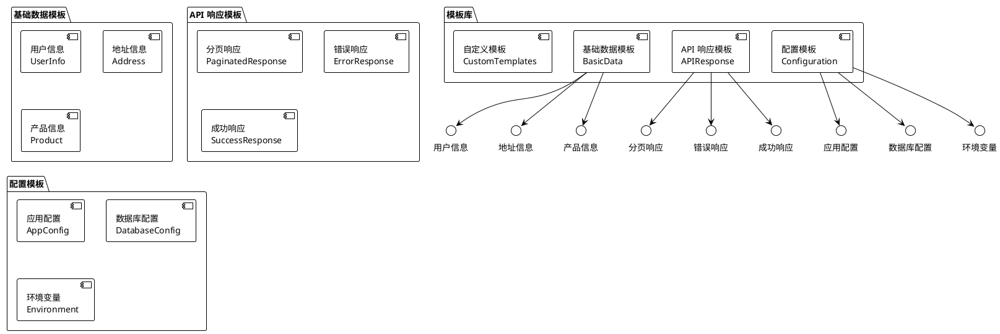

#### 3.2.2 模板使用流程

```plantuml
@startuml
!theme plain
start

:用户打开模板库;

:选择模板分类;

:预览模板结构;

if (应用方式？) then (插入到选中节点)
  :将模板插入到当前选中节点;
  :作为子节点添加;
else (替换选中节点)
  :替换当前选中的节点;
  :保留节点 key;
else (创建新文件)
  :使用模板创建新 JSON 文件;
  :在文件浏览器中显示;
endif

:更新树结构;

:同步到代码编辑器;

stop

@enduml
```

#### 3.2.3 自动补全系统

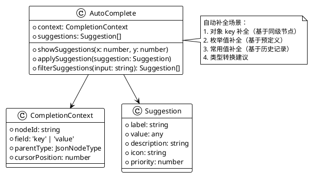

### 3.3 可视化转换系统

#### 3.3.1 转换类型

```plantuml
@startuml
!theme plain
package "转换引擎" {
  [结构转换\nStructureTransform] as ST
  [数据映射\nDataMapping] as DM
  [格式转换\nFormatTransform] as FT
  [批量操作\nBatchOperations] as BO
}

package "结构转换" {
  [数组转对象\nArrayToObject]
  [对象转数组\nObjectToArray]
  [扁平化\nFlatten]
  [嵌套化\nNestify]
}

package "数据映射" {
  [字段重命名\nRenameField]
  [字段移动\nMoveField]
  [字段复制\nCopyField]
  [字段删除\nDeleteField]
}

package "格式转换" {
  [JSON 转 CSV\nJsonToCsv]
  [JSON 转 XML\nJsonToXml]
  [JSON 转 YAML\nJsonToYaml]
  [压缩/格式化\nMinify/Prettify]
}

package "批量操作" {
  [批量重命名\nBatchRename]
  [批量类型转换\nBatchTypeConvert]
  [批量删除\nBatchDelete]
  [批量更新\nBatchUpdate]
}

ST --> [数组转对象\nArrayToObject]
ST --> [对象转数组\nObjectToArray]
ST --> [扁平化\nFlatten]
ST --> [嵌套化\nNestify]

DM --> [字段重命名\nRenameField]
DM --> [字段移动\nMoveField]
DM --> [字段复制\nCopyField]
DM --> [字段删除\nDeleteField]

FT --> [JSON 转 CSV\nJsonToCsv]
FT --> [JSON 转 XML\nJsonToXml]
FT --> [JSON 转 YAML\nJsonToYaml]
FT --> [压缩/格式化\nMinify/Prettify]

BO --> [批量重命名\nBatchRename]
BO --> [批量类型转换\nBatchTypeConvert]
BO --> [批量删除\nBatchDelete]
BO --> [批量更新\nBatchUpdate]

@enduml
```

#### 3.3.2 转换流程

```plantuml
@startuml
!theme plain
start

:用户选择转换操作;

:选择转换类型;

if (转换类型？) then (结构转换)
  :配置转换参数;
  :预览转换结果;
  :确认执行;
  
else (数据映射)
  :选择源字段;
  :选择目标位置;
  :配置映射规则;
  :确认执行;
  
else (格式转换)
  :选择目标格式;
  :配置格式选项;
  :预览转换结果;
  :确认执行;
  
else (批量操作)
  :选择操作范围;
  :配置操作参数;
  :预览操作结果;
  :确认执行;
endif

:执行转换;

:更新树结构;

:同步到代码编辑器;

:显示转换结果;

stop

@enduml
```

### 3.4 多视图系统

#### 3.4.1 视图类型

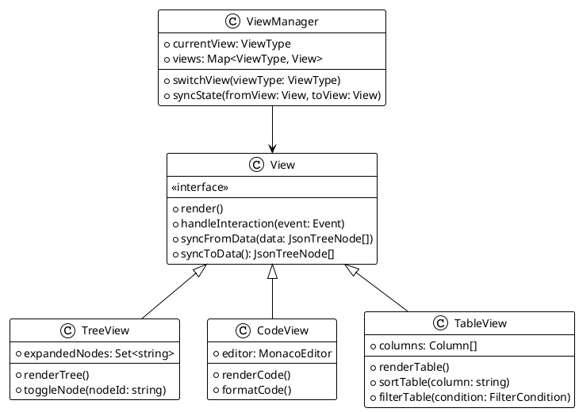

#### 3.4.2 视图同步机制

```plantuml
@startuml
!theme plain
start

:用户在任意视图编辑;

:视图触发 onChange 事件;

:useJsonSync 接收变更;

if (变更来源？) then (树形视图)
  :treeToJson 转换;
  :更新 JSON 文本;
  :构建位置映射;
else (代码视图)
  :JSON.parse 解析;
  :jsonToTree 转换;
  :构建位置映射;
else (表格视图)
  :tableToJson 转换;
  :更新 JSON 文本;
  :jsonToTree 转换;
endif

:通知所有视图同步;

fork
  :TreeView 同步;
  :更新树形结构;
  :保持展开状态;
fork again
  :CodeView 同步;
  :更新代码内容;
  :保持光标位置;
fork again
  :TableView 同步;
  :更新表格数据;
  :保持排序/过滤;
end fork

:更新状态栏;

stop

@enduml
```

## 4. 技术实现方案

### 4.1 技术栈

| 模块 | 技术方案 | 说明 |
|------|---------|------|
| 树形组件 | react-arborist | 成熟的树形编辑组件 |
| 代码编辑器 | Monaco Editor | VSCode 同款编辑器 |
| 状态管理 | React Hooks | useState、useCallback |
| 样式方案 | CSS Modules | 模块化样式 |
| 桌面应用 | Electron | 跨平台桌面应用 |
| 图标库 | lucide-react | 现代化图标 |

### 4.2 核心 Hook 实现

#### 4.2.1 useJsonSync

```typescript
// 核心同步逻辑
export function useJsonSync() {
  const [jsonText, setJsonText] = useState('');
  const [treeData, setTreeData] = useState<JsonTreeNode[]>([]);
  const [parseError, setParseError] = useState<string | null>(null);
  const [positionMap, setPositionMap] = useState<Map<string, PositionInfo>>(new Map());

  const isUpdatingFromTreeRef = useRef(false);

  // 从树更新到代码
  const updateFromTree = useCallback((newTree: JsonTreeNode[]) => {
    isUpdatingFromTreeRef.current = true;
    setTreeData(newTree);
    try {
      const json = treeToJson(newTree);
      const text = JSON.stringify(json, null, 2);
      setJsonText(text);
      setPositionMap(buildPositionMap(newTree));
      setParseError(null);
    } catch (e) {
      setParseError(`序列化错误: ${(e as Error).message}`);
    }
    setTimeout(() => {
      isUpdatingFromTreeRef.current = false;
    }, 0);
  }, []);

  // 从代码更新到树
  const updateFromCode = useCallback((newText: string, immediate?: boolean) => {
    if (isUpdatingFromTreeRef.current) return;

    setJsonText(newText);

    if (immediate) {
      // 立即解析
      try {
        if (newText.trim()) {
          const parsed = JSON.parse(newText);
          const formatted = JSON.stringify(parsed, null, 2);
          const tree = jsonToTree(parsed);
          setJsonText(formatted);
          setTreeData(tree);
          setPositionMap(buildPositionMap(tree));
        } else {
          setTreeData([]);
          setPositionMap(new Map());
        }
        setParseError(null);
      } catch (e) {
        setParseError((e as Error).message);
      }
    } else {
      // 防抖解析
      treeUpdateTimerRef.current = setTimeout(() => {
        // 同上逻辑
      }, 300);
    }
  }, []);

  return { jsonText, treeData, parseError, positionMap, updateFromTree, updateFromCode, isUpdatingFromTreeRef };
}
```

#### 4.2.2 treeUtils 增强

```typescript
// 新增功能
export function batchUpdate(
  nodes: JsonTreeNode[],
  ids: string[],
  updater: (node: JsonTreeNode) => JsonTreeNode
): JsonTreeNode[] {
  const idSet = new Set(ids);
  return nodes.map(node => {
    if (idSet.has(node.id)) return updater(node);
    if (node.children) {
      return { ...node, children: batchUpdate(node.children, ids, updater) };
    }
    return node;
  });
}

export function flattenTree(
  nodes: JsonTreeNode[],
  separator = '.'
): Record<string, unknown> {
  const result: Record<string, unknown> = {};
  
  function flatten(node: JsonTreeNode, path: string[]) {
    const currentPath = [...path, node.key].filter(k => k);
    const key = currentPath.join(separator);
    
    if (node.type === 'object' || node.type === 'array') {
      node.children?.forEach(child => flatten(child, currentPath));
    } else {
      result[key] = node.value;
    }
  }
  
  nodes.forEach(node => flatten(node, []));
  return result;
}

export function nestifyFlat(
  flat: Record<string, unknown>,
  separator = '.'
): JsonTreeNode[] {
  const result: JsonTreeNode[] = [];
  
  for (const [key, value] of Object.entries(flat)) {
    const parts = key.split(separator);
    let current = result;
    
    for (let i = 0; i < parts.length; i++) {
      const part = parts[i];
      const existing = current.find(n => n.key === part);
      
      if (existing && i < parts.length - 1) {
        current = existing.children!;
      } else if (i === parts.length - 1) {
        current.push({
          id: genId(),
          key: part,
          value,
          type: getType(value),
        });
      } else {
        const newNode: JsonTreeNode = {
          id: genId(),
          key: part,
          value: null,
          type: 'object',
          children: [],
        };
        current.push(newNode);
        current = newNode.children!;
      }
    }
  }
  
  return result;
}
```

### 4.3 性能优化策略

#### 4.3.1 渲染优化

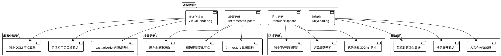

#### 4.3.2 状态管理优化

```typescript
// 使用 useRef 避免不必要的重渲染
const isUpdatingFromTreeRef = useRef(false);

// 使用 useCallback 缓存函数
const updateFromTree = useCallback((newTree: JsonTreeNode[]) => {
  // ...
}, []);

// 使用 useMemo 缓存计算结果
const positionMap = useMemo(() => {
  return buildPositionMap(treeData);
}, [treeData]);
```

## 5. 用户交互设计

### 5.1 主要交互流程

#### 5.1.1 创建新 JSON

```plantuml
@startuml
!theme plain
start

:用户点击"新建文件";

:显示创建向导;

if (创建方式？) then (从模板创建)
  :显示模板库;
  :用户选择模板;
  :预览模板结构;
  :确认使用模板;
else (空白创建)
  :创建空 JSON 对象 {};
else (导入创建)
  :选择导入格式;
  :上传/粘贴数据;
  :解析并导入;
endif

:生成初始 JSON;

:显示在编辑器中;

:用户可以继续编辑;

stop

@enduml
```

#### 5.1.2 树形编辑操作

```plantuml
@startuml
!theme plain
start

:用户在树形视图中操作;

if (操作类型？) then (编辑节点)
  :双击 key 或 value;
  :进入编辑模式;
  :修改内容;
  :按 Enter 确认或 Esc 取消;
  :触发 onChange;
  
else (添加子节点)
  :点击 + 按钮;
  :弹出添加节点对话框;
  :输入 key 和选择类型;
  :确认添加;
  :新节点添加到末尾;
  
else (删除节点)
  :点击 × 按钮;
  :弹出确认对话框;
  :确认后删除节点;
  :焦点移到父节点;
  
else (拖拽排序)
  :拖拽节点;
  :放置到目标位置;
  :节点移动到新位置;
  
else (展开/折叠)
  :点击展开箭头;
  :或双击节点;
  :切换展开状态;
endif

:同步到代码编辑器;

:更新状态栏;

stop

@enduml
```

### 5.2 快捷键设计

| 快捷键 | 功能 | 适用视图 |
|-------|------|---------|
| Ctrl+N | 新建文件 | 全局 |
| Ctrl+O | 打开文件 | 全局 |
| Ctrl+S | 保存文件 | 全局 |
| F2 | 重命名节点 | 树形 |
| Delete | 删除节点 | 树形 |
| Insert | 添加子节点 | 树形 |
| Ctrl+F | 查找 | 全局 |
| Ctrl+H | 替换 | 全局 |
| Ctrl+C | 复制节点 | 树形 |
| Ctrl+V | 粘贴节点 | 树形 |
| Ctrl+X | 剪切节点 | 树形 |
| Ctrl+Z | 撤销 | 全局 |
| Ctrl+Y | 重做 | 全局 |

## 6. 扩展性设计

### 6.1 插件系统

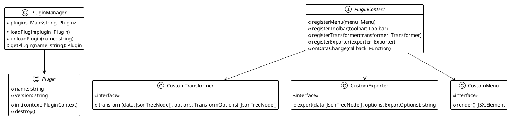

### 6.2 导出格式扩展

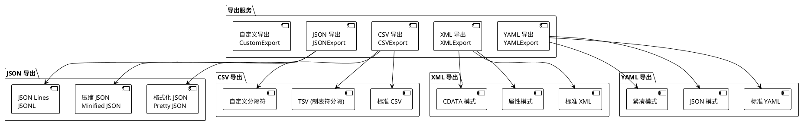

## 7. 实施计划

### 7.1 阶段划分

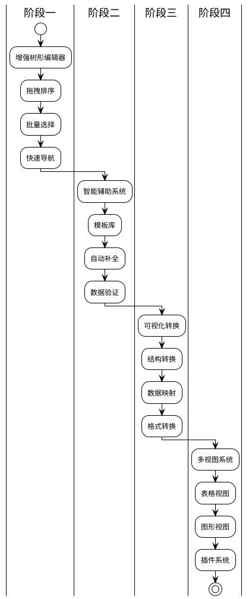

### 7.2 里程碑

| 阶段 | 时间 | 目标 | 交付物 |
|------|------|------|--------|
| 阶段一 | 2周 | 增强树形编辑器 | 拖拽排序、批量操作 |
| 阶段二 | 2周 | 智能辅助系统 | 模板库、自动补全 |
| 阶段三 | 2周 | 可视化转换 | 结构转换、格式转换 |
| 阶段四 | 2周 | 多视图系统 | 表格视图、插件系统 |

## 8. 风险与挑战

### 8.1 技术风险

| 风险 | 影响 | 缓解措施 |
|------|------|---------|
| 大文件性能 | 编辑卡顿 | 虚拟化渲染、分块加载 |
| 双向同步复杂度 | 数据不一致 | 统一数据源、严格测试 |
| 浏览器兼容性 | 功能受限 | 渐进增强、polyfill |
| Electron 打包体积 | 安装包过大 | 按需加载、代码分割 |

### 8.2 用户体验风险

| 风险 | 影响 | 缓解措施 |
|------|------|---------|
| 学习成本 | 用户难以上手 | 引导教程、模板库 |
| 操作复杂度 | 效率低下 | 快捷键、批量操作 |
| 视觉混乱 | 信息过载 | 分层展示、可折叠 |

## 9. 总结

本设计方案基于 json-viewer 的现有架构，通过增强树形编辑器、智能辅助系统、可视化转换和多视图系统，为用户提供更强大的 JSON 可视化编程能力。

关键创新点：
1. **增强树形编辑**：拖拽排序、批量操作、快速导航
2. **智能辅助系统**：模板库、自动补全、数据验证
3. **可视化转换**：结构转换、数据映射、格式转换
4. **多视图协同**：树形、代码、表格视图无缝切换
5. **插件系统**：支持功能扩展和自定义

通过分阶段实施，可以逐步交付功能，降低风险，确保项目成功。
